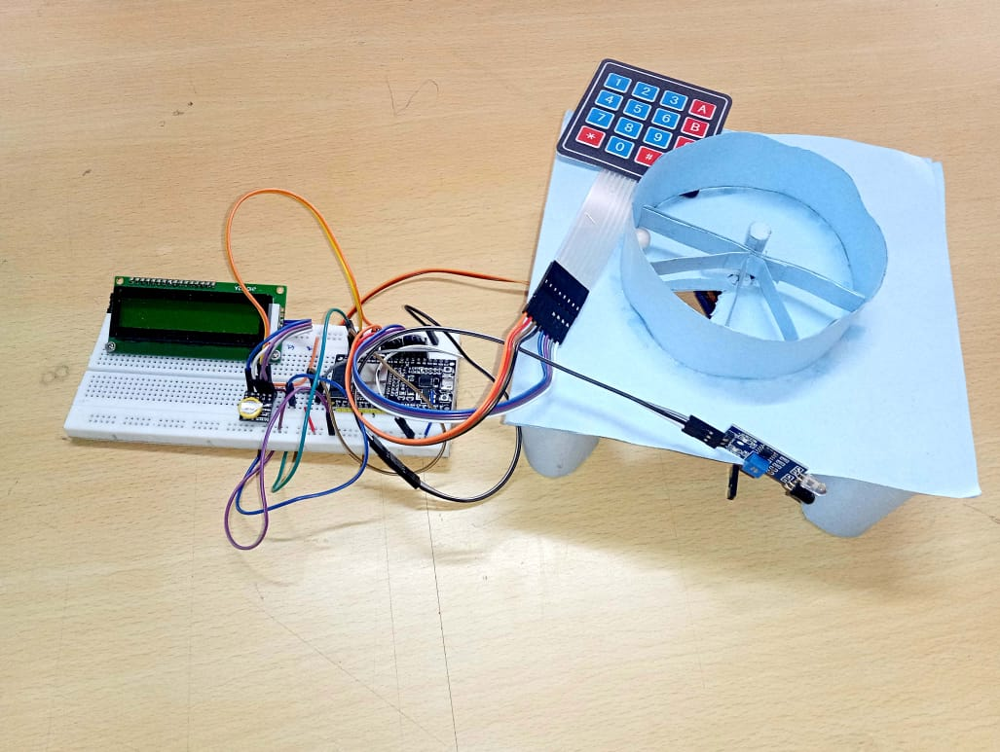
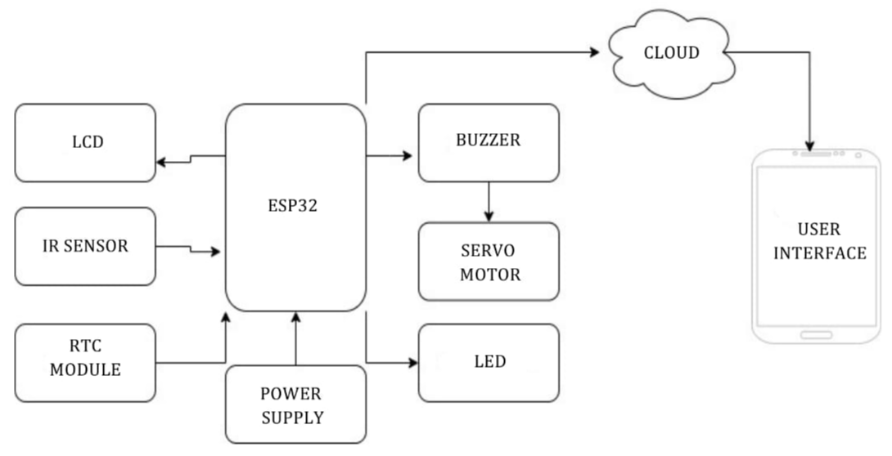
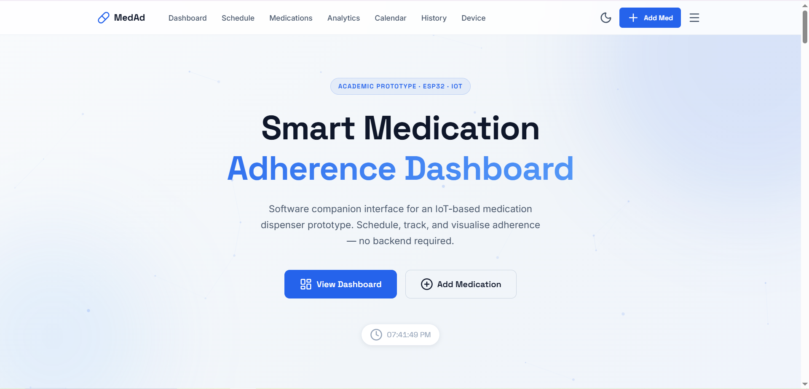
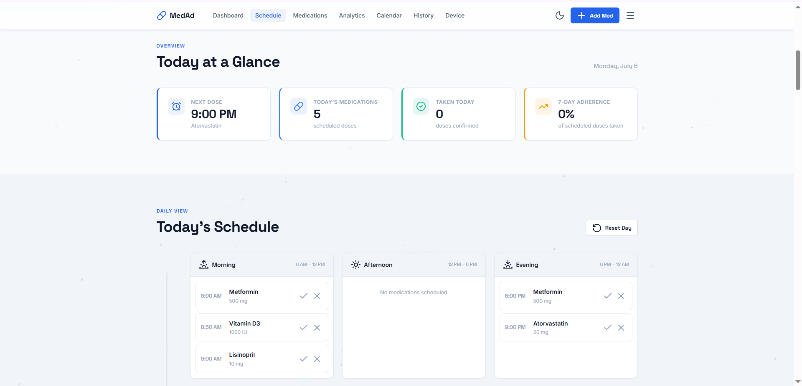
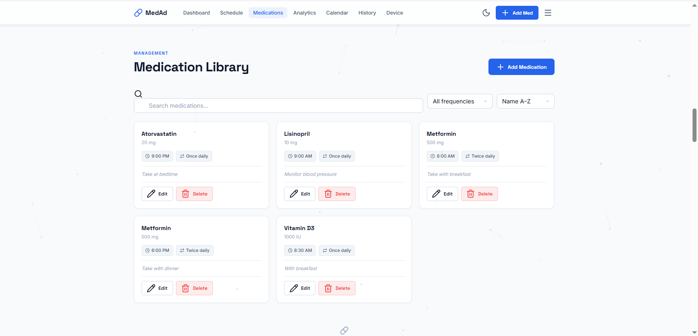
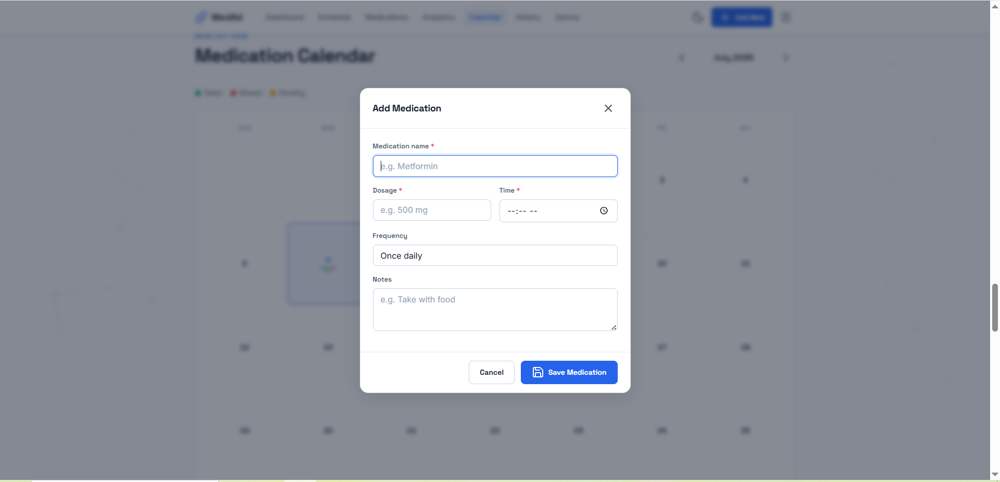
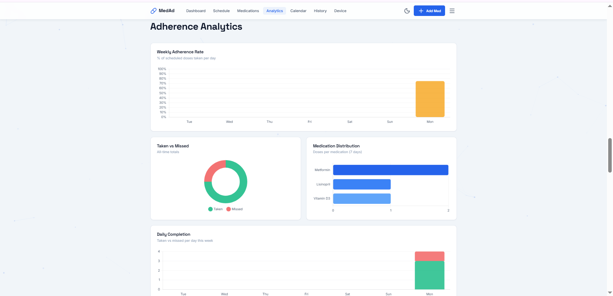
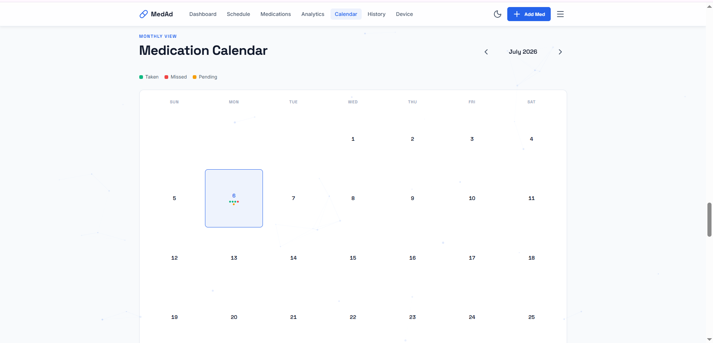
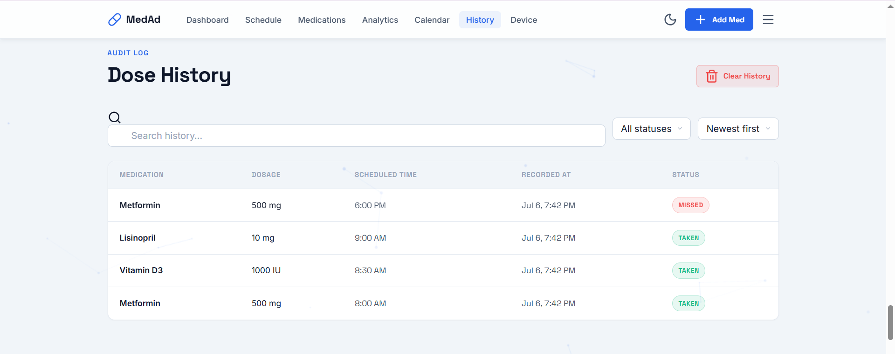
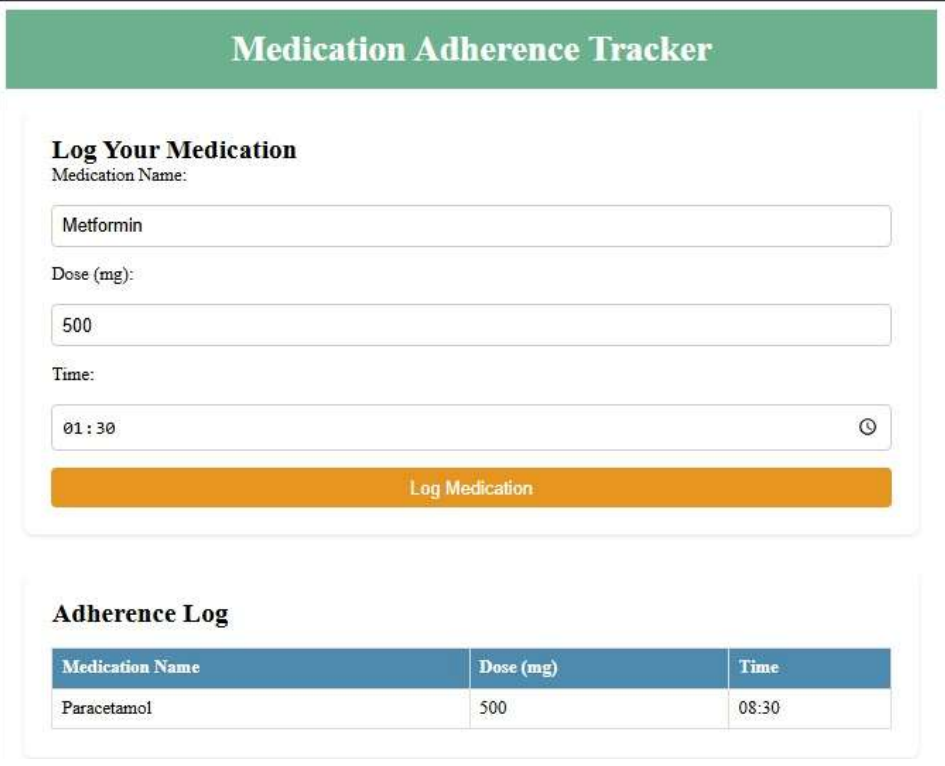

<p align="center">
  
</p>

<h1 align="center">Smart Medication Dispenser & Adherence Tracker</h1>

<p align="center">
A companion medication management dashboard for an ESP32 smart medication dispenser prototype.
</p>

<p align="center">
<strong>Hardware Prototype • Embedded Systems • Modern Frontend • Portfolio Project</strong>
</p>

<p align="center">
  
  
  
  
  
  
  
  
  
</p>

<p align="center">
💊 Medication Management &nbsp;•&nbsp; 📊 Analytics &nbsp;•&nbsp; 📅 Calendar &nbsp;•&nbsp; 📈 Adherence Tracking
</p>

---

## Live Demo

**Medication Management and Adherence Dashboard**

👉 **https://smart-medication-dispenser.vercel.app/**

---


# Overview

Smart Medication Dispenser combines an **ESP32-based medication dispensing prototype** with a modern browser-based dashboard for medication management, scheduling, history, and adherence tracking.

The repository represents two stages of development. The embedded hardware and firmware originated as an undergraduate **Electronics & Communication Engineering** mini project. After the academic project concluded, I independently redesigned the software by building a new browser dashboard, reorganizing the repository, rewriting the documentation, and preparing the project for deployment and portfolio presentation.

---

# Demo

<p align="center">

</p>

---

# Highlights

- Modern browser-based medication management dashboard
- ESP32 smart medication dispenser prototype
- Medication scheduling and adherence tracking
- Calendar and medication history
- Interactive analytics
- Responsive Light & Dark UI
- Browser Local Storage
- Modular JavaScript architecture

---

# Why This Project?

Managing medications on a fixed schedule can be difficult, particularly for users taking multiple prescriptions throughout the day.

The embedded prototype addresses this by allowing medication times to be configured directly on the device using the keypad. The ESP32 continuously monitors the schedule using an RTC module and automatically dispenses medication at the configured time while providing visual and audible reminders.

While the hardware provides the core dispensing functionality, its on-device interface is naturally limited. A companion dashboard can extend the experience by offering medication management, calendar planning, history, and adherence analytics without changing the embedded hardware itself.

| Capability | Embedded Prototype | Modern Dashboard |
|------------|:-----------------:|:----------------:|
| Medication Scheduling | ✅ | ✅ |
| Medication Library | Limited | ✅ |
| Calendar View | ❌ | ✅ |
| Medication History | Limited | ✅ |
| Analytics | ❌ | ✅ |
| Responsive Interface | ❌ | ✅ |
| Browser Access | ❌ | ✅ |
| Local Data Storage | Limited | ✅ |

---

# Project Evolution

```text
2024–25
Academic Mini Project
│
├── ESP32 medication dispenser
├── Embedded firmware
├── Hardware prototype
├── Basic HTML demonstration page
└── Team project

                    │
                    ▼

2026
Independent Repository Revamp
│
├── Modern browser dashboard
├── Responsive UI/UX
├── Medication management
├── Analytics
├── Calendar
├── History
├── Browser Local Storage
├── Repository organization
├── Documentation
└── Deployment
```

---

# Hardware Prototype

<p align="center">

</p>

The embedded prototype demonstrates an automated medication dispensing system developed during an undergraduate Electronics & Communication Engineering mini project.

### Major Components

| Component | Purpose |
|-----------|----------|
| ESP32 | Main controller |
| DS3231 RTC | Timekeeping |
| Servo Motor | Medication dispensing |
| IR Sensor | Dispense detection |
| 16×2 LCD | User interface |
| Keypad | User input |
| LEDs | Status indication |
| Buzzer | Reminder alerts |

To preserve the academic integrity of the original project, detailed circuit diagrams, GPIO mappings, wiring, and firmware implementation details are intentionally omitted.

---

# System Architecture

<p align="center">

</p>

The architecture combines an embedded medication dispenser with a browser dashboard that extends the user experience through medication management, scheduling, adherence tracking, and history visualization.

---

# Software Dashboard

The browser dashboard complements the embedded prototype with a modern interface for medication management, scheduling, history, and adherence tracking.

Designed as a standalone frontend application, it provides a richer user experience through responsive layouts, calendar views, adherence analytics, and browser-based data persistence.

---

### Features

- Dashboard overview
- Medication library
- Medication scheduling
- Calendar interface
- Medication history
- Adherence analytics
- Browser Local Storage
- Responsive layout
- Light & Dark themes

---

# Screenshots

## Hero

Landing interface of the redesigned application.



---

## Dashboard Overview

Today's medications, schedules, and adherence summary.



---

## Medication Library

Manage medications, dosages, schedules, and notes.



---

## Add Medication

Create medication schedules using a modern modal interface.



---

## Analytics

Monitor medication adherence using visual summaries.



---

## Calendar

View medication schedules across the month.



---

## History

Review previous medication events and adherence records.



---

## Original Academic Demonstration Page

Included for historical reference to show the evolution of the project.



---

# Technology Stack

| Category | Technologies |
|-----------|--------------|
| Embedded | ESP32, Arduino, C++ |
| Frontend | HTML5, CSS3, JavaScript (ES6) |
| Storage | Browser Local Storage |
| Deployment | Vercel |
| Design | Responsive UI, Light & Dark Theme |

---

# Engineering Decisions

Several design decisions were made during the independent software redesign.

- Browser Local Storage keeps the application completely standalone.
- No backend was introduced to simplify deployment and portability.
- The frontend was organized into modular JavaScript components for maintainability.
- The dashboard is intentionally decoupled from the embedded hardware so it can function as a standalone browser application.
- The original embedded implementation remains preserved while the software experience has been modernized.

---

# Challenges

Throughout both stages of the project, several engineering challenges were addressed.

- RTC-based medication scheduling
- Coordinating multiple embedded peripherals
- Servo-controlled dispensing
- IR-based dispense detection
- Designing a maintainable frontend architecture
- Transforming a basic HTML demonstration page into a modern dashboard
- Reorganizing an academic project into a polished public repository
- Clearly separating academic work from independent contributions

---

# Future Improvements

- Real-time ESP32 integration
- Cloud synchronization
- Reminder notifications
- Mobile companion application
- Progressive Web App (PWA)
- Multiple user profiles
- Data import and export

---

# Project Notes

This repository intentionally omits detailed hardware wiring, GPIO mappings, and firmware implementation specifics to preserve the academic integrity of the original mini project.

The included browser dashboard extends the concepts introduced by the original embedded prototype while remaining a standalone browser application.

---

# License & Copyright

© 2026 Harsham Irfan Bhat.

The source code in this repository is licensed under the MIT [LICENSE](LICENSE).

The visual design, branding, documentation, screenshots, and other non-code assets remain copyright of Harsham Irfan Bhat unless explicitly stated otherwise.

---

# Author

**Harsham Irfan Bhat**

📧 harshamirfan@gmail.com

💼 https://www.linkedin.com/in/harsham-irfan-bhat/

---

<p align="center">
If you found this project interesting, consider giving it a ⭐
</p>